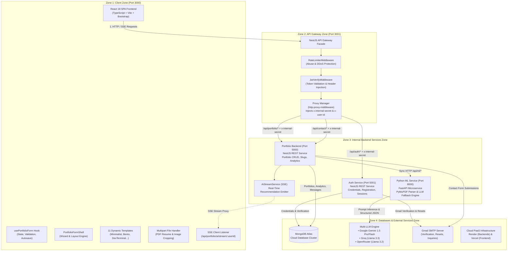

# 🏛️ System Architecture Overview

Portfolio Builder 2.0 is structured as a **distributed microservices architecture** optimized for separation of concerns, independent deployability, granular security perimeters, and high developer velocity.

---

## 📐 Overall Architectural Blueprint

The application is segregated into four distinct operational zones:



---

## 🔍 Zone Descriptions

### 1. Client Zone (Port 3000)
- **Framework:** React 18, TypeScript, Vite.
- **Role:** Handles presentation, responsive multi-step portfolio creation, real-time previewing, and public rendering.
- **Key Modules:**
  - `usePortfolioForm`: Custom React hook maintaining unified portfolio draft state, dirty-checking, and optimistic UI updates.
  - `PortfolioFormShell`: Multi-step navigation shell containing collapsible form sections for Personal Info, Work Experience, Projects, Skills, Education, and Theme configuration.
  - `ResumeParsingLoader`: Animated multi-phase visual indicator showing parsing progress when an uploaded resume PDF is processed.
  - `TemplateRenderer`: Dynamic component switching among **11 curated themes** (Minimalist, BentoGrid, DevTerminal, GamifiedRPG, AcademicLaTeX, etc.).
  - `SSE Client Listener`: EventSource listening to `/api/portfolio/ai/stream/:userId` to render live streaming recommendations.

---

### 2. API Gateway Zone (Port 3001)
- **Framework:** NestJS, TypeScript, `http-proxy-middleware`.
- **Role:** Serves as the sole public gateway for all backend traffic. Protects upstream internal microservices from direct internet exposure.
- **Core Pipeline:**
  1. **Correlation Tracking (`CorrelationIdMiddleware`):** Assigns a unique `x-correlation-id` UUID to every incoming request for distributed logging.
  2. **Rate Limiting (`RateLimiterMiddleware`):** Prevents brute-force attacks and abuse by throttling requests per IP address.
  3. **JWT Verification (`JwtVerifyMiddleware`):** Inspects incoming HttpOnly cookies or `Authorization: Bearer` headers. Validates signature with `JWT_SECRET`. Extracts `userId` and `role`, injecting `x-user-id` and `x-user-role` downstream.
  4. **Internal Secret Injection (`Proxy Manager`):** Attaches `x-internal-secret` to every proxied request. This shared secret guarantees downstream services only accept requests arriving via the gateway.

---

### 3. Internal Backend Services Zone
- **Auth Service (Port 5001):**
  - Manages user accounts, bcrypt password hashing, and user authentication.
  - Implements email verification workflows via Gmail SMTP.
  - Issues access JWT tokens and refresh JWT tokens stored in HttpOnly cookies.
- **Portfolio Backend (Port 5000):**
  - Core business logic engine managing portfolio schemas, templates, theme configurations, and custom public slugs (`/p/:slug`).
  - Processes contact form submissions from visitors and sends email notifications to portfolio owners.
  - Aggregates portfolio analytics: total views, project click-throughs, and resume downloads.
  - Orchestrates AI resume parsing and content enhancement by calling the ML Service.
- **Python ML Service (Port 8000):**
  - High-performance FastAPI service dedicated to CPU-bound PDF parsing and asynchronous LLM inferences.
  - Uses `PyMuPDF` (`fitz`) and `pdfminer` for layout-aware PDF text extraction.
  - Dispatches structured prompts to Gemini 1.5, Groq, or OpenRouter, returning strict Pydantic-validated JSON.

---

### 4. Databases & External Services Zone
- **MongoDB Atlas:** Managed multi-tenant cloud database storing user documents, portfolio schemas, analytics events, and contact messages.
- **Google Gemini & LLM Providers:** External AI models queried for resume text parsing and bullet-point enhancement (STAR method).
- **Gmail SMTP Server:** Enterprise email relay using Google App Passwords for transactional emails.
- **Render & Vercel:** Production hosting platforms with zero infrastructure maintenance.

---

## 🛡️ Distributed Security Architecture

```
Internet Request ──► [ API Gateway ] ──(x-internal-secret + x-user-id)──► [ Microservices ]
                         │
                         ▼
        Direct Internet Request to Port 5000/5001/8000 ──► ❌ 403 Forbidden
```

1. **Gateway Perimeter Defense:** Upstream services (`auth-service`, `portfolio_backend_nestjs`) employ `InternalAuthGuard`. Any request that lacks a valid `x-internal-secret` header is immediately rejected with `403 Forbidden`.
2. **HttpOnly Cookie Security:** Access and refresh tokens are stored in secure, HttpOnly, SameSite cookies, making them inaccessible to client-side JavaScript and immune to XSS token theft.
3. **Decentralized User Context:** The API Gateway decodes the JWT once and injects `x-user-id` into headers. Downstream services do not need to re-verify token signatures or maintain session state.

---

## 🔄 Architectural Evolution: RabbitMQ vs. Direct HTTP/SSE

In earlier design iterations (as represented in the original architecture diagram), RabbitMQ was planned as an asynchronous message bus connecting the Portfolio Backend and Python ML Service (`portfolio_ml_queue` and `portfolio_backend_queue`).

### Why Direct HTTP & SSE Was Adopted:
1. **Interactive User Experience:** Users uploading a PDF resume expect immediate feedback (within 3–8 seconds). Asynchronous message queues added unnecessary message serialization and polling overhead.
2. **Real-Time Streaming:** By implementing Server-Sent Events (SSE) via `AiStreamService`, suggestions and enhancement progress are streamed directly to the frontend over a persistent HTTP connection.
3. **PaaS & Serverless Efficiency:** Running RabbitMQ in cloud environments (like Render or cloud containers) requires dedicated broker nodes and connection management. Replacing it with direct HTTP APIs and SSE eliminated broker maintenance and allowed deployment on 100% free cloud tiers.

---

[View Visual Architecture Diagram ➔](Architecture-Daigram)
