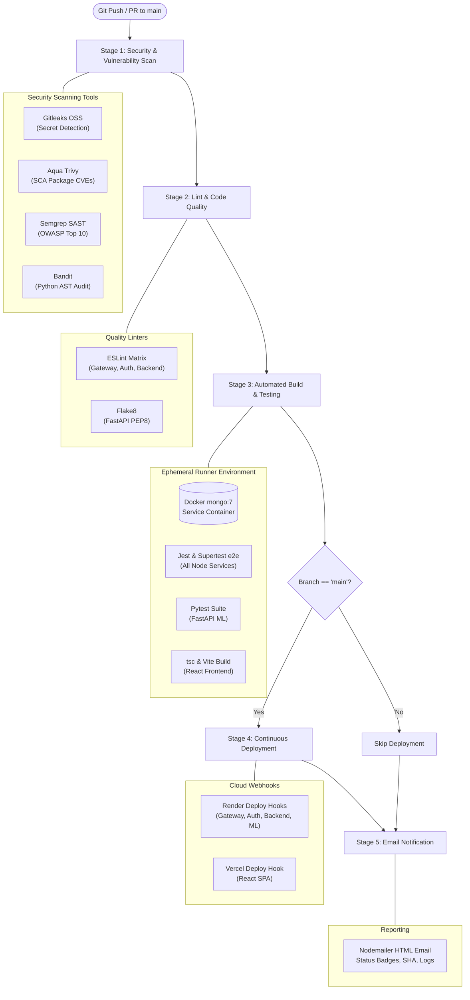

# ⚙️ CI/CD Pipeline & DevOps Guide

Portfolio Builder 2.0 incorporates a **production-grade, 100% free automated CI/CD pipeline** implemented in GitHub Actions ([`.github/workflows/ci-cd.yml`](file:///c:/Users/E1536912/Documents/PORTFOLIO/.github/workflows/ci-cd.yml)). Every code commit and pull request is automatically audited for vulnerabilities, formatted, tested with ephemeral container databases, built, deployed, and reported.

---

## 🌊 Pipeline Architecture & Stages

---

## 📌 Detailed Stage Breakdown

### Stage 1: Security & Vulnerability Scan (`security-scan`)
- **Gitleaks Secret Detection:** Deep-scans git history to catch committed tokens, API keys, and database passwords before they reach production.
- **Aqua Trivy SCA:** Scans `package-lock.json` and Python `requirements.txt` for known Common Vulnerabilities and Exposures (CVEs) with `CRITICAL` or `HIGH` severity.
- **Semgrep SAST:** Evaluates TypeScript and Python source code against official rulesets: `p/security-audit` and `p/owasp-top-ten`.
- **Bandit Python Audit:** Inspects FastAPI AST structures for security issues (insecure deserialization, weak ciphers).

### Stage 2: Lint & Code Quality (`lint` & `lint-python`)
- **ESLint Matrix:** Concurrently audits `api-gateway`, `auth-service`, and `portfolio_backend_nestjs` for type consistency and code quality.
- **Flake8 Audit:** Audits `ml-service-python` for PEP8 compliance and cyclomatic complexity limits (`--max-complexity=10`).

### Stage 3: Automated Build & Testing (`test-and-build`)
- **Ephemeral MongoDB Container:** The GitHub runner automatically boots an isolated `mongo:7` service container with port mapping `27017:27017`.
- **Microservices Compilation:** Compiles all 3 NestJS projects using `npm run build`.
- **Unit & Integration Tests:** Executes Jest unit tests (`npm run test`) and Supertest API tests (`npm run test:e2e`) against the live ephemeral MongoDB container.
- **Python ML Tests:** Runs `pytest tests/` for FastAPI endpoints and Pydantic schema validation.
- **Frontend Build:** Runs `tsc --noEmit` type checking and compiles the Vite production bundle.

### Stage 4: Continuous Deployment (`deploy`)
- Executes **strictly on push to `main`** after Stages 1, 2, and 3 pass with 100% success.
- **Render Zero-Downtime Deployment:** Dispatches parallel HTTP POST triggers to Render Deploy Hooks:
  - `portfolio-api-gateway`
  - `portfolio-auth-service`
  - `portfolio-backend`
  - `portfolio-ml-service`
- **Vercel Frontend Deployment:** Dispatches webhook trigger to Vercel Deploy Hook to rebuild and deploy the React bundle on edge CDNs.

### Stage 5: Email Notification (`notify`)
- Runs unconditionally (`if: always()`) via the custom composite action `.github/actions/send-email-report`.
- Dispatches a dark-themed, responsive HTML status email with build metrics, author, commit hash, and direct links to GitHub Actions run logs.

---

## 🔑 Required GitHub Secrets (100% Free)

Configure in GitHub: **Settings ➔ Secrets and variables ➔ Actions ➔ New repository secret**

| Secret Name | Category | Description | Example / Format |
|---|---|---|---|
| `RENDER_GATEWAY_DEPLOY_HOOK` | Deploy | Render Webhook URL for API Gateway | `https://api.render.com/deploy/srv-c...` |
| `RENDER_AUTH_DEPLOY_HOOK` | Deploy | Render Webhook URL for Auth Service | `https://api.render.com/deploy/srv-c...` |
| `RENDER_BACKEND_DEPLOY_HOOK` | Deploy | Render Webhook URL for Portfolio Backend | `https://api.render.com/deploy/srv-c...` |
| `RENDER_ML_DEPLOY_HOOK` | Deploy | Render Webhook URL for ML Service | `https://api.render.com/deploy/srv-c...` |
| `VERCEL_DEPLOY_HOOK` | Deploy | Vercel Git Deploy Hook URL | `https://api.vercel.com/v1/integrations/deploy/prj_...` |
| `MAIL_USERNAME` | Notify | Gmail address used by Nodemailer | `your-email@gmail.com` |
| `MAIL_PASSWORD` | Notify | 16-character Google App Password | `xxxx xxxx xxxx xxxx` |
| `NOTIFICATION_EMAIL` | Notify | Destination recipient email | `recipient@example.com` |
| `GROQ_API_KEY` | Testing | Groq Cloud API key for CI live tests | `gsk_...` |
| `OPENROUTER_API_KEY` | Testing | OpenRouter API key | `sk-or-...` |
| `GEMINI_API_KEY` | Testing | Google Gemini AI Studio API key | `AIzaSy...` |

---

## 📁 Modular Composite Actions

To avoid duplicate code across jobs, the pipeline leverages three reusable composite actions:

1. **[setup-node-service](file:///c:/Users/E1536912/Documents/PORTFOLIO/.github/actions/setup-node-service/action.yml):** Configures Node.js 18 with automatic `npm` dependency caching.
2. **[setup-python-service](file:///c:/Users/E1536912/Documents/PORTFOLIO/.github/actions/setup-python-service/action.yml):** Configures Python 3.11 with `pip` dependency caching.
3. **[send-email-report](file:///c:/Users/E1536912/Documents/PORTFOLIO/.github/actions/send-email-report/action.yml):** Builds and dispatches the dark-themed HTML report via Nodemailer SMTP.

---

[Explore Deployment & Hosting Guide ➔](Deployment-and-Hosting-Guide)
