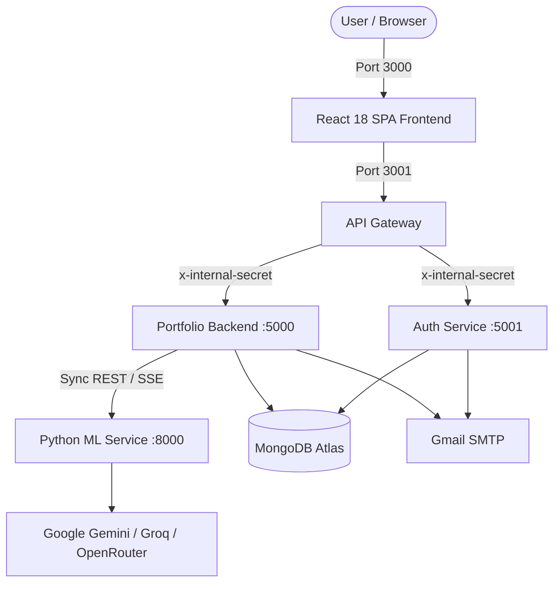

# 🚀 Welcome to Portfolio Builder 2.0 Wiki

Welcome to the official technical documentation for **Portfolio Builder 2.0** — an AI-powered, microservices-based full-stack platform designed to help developers showcase their identity, projects, and skills through 11+ dynamic, production-grade templates.

---

### 🌟 Project At A Glance

| Domain | Implementation |
|---|---|
| **Architecture** | Microservices Architecture with NestJS API Gateway, Independent Services, and Distributed Auth |
| **Frontend** | React 18, TypeScript, Vite, Bootstrap, Modular Responsive Themes |
| **Backend Services** | NestJS (API Gateway, Auth Service, Portfolio Monolith) |
| **AI / Machine Learning** | Python 3.11, FastAPI, PyMuPDF, Multi-Provider LLM Fallback (Groq, OpenRouter, Gemini) |
| **Database** | MongoDB Atlas (Multi-Tenant Document Store) |
| **DevOps & CI/CD** | 5-Stage GitHub Actions (Gitleaks, Trivy, Semgrep, Bandit, Ephemeral Docker MongoDB, Supertest, Pytest) |
| **Hosting & Cloud** | Free-tier deployment on Render (Backend services) and Vercel (Frontend SPA) |

---

## 🗺️ Documentation Index

### 1. 🏛️ [System Architecture](Architecture-Overview)
Understand the overall four-zone architecture: **Client Zone**, **API Gateway Zone**, **Internal Backend Services Zone**, and **Databases & External Zone**. Learn about data flow, security boundary enforcement (`x-internal-secret`), and architectural evolution from message queues to streamlined HTTP/SSE streaming.

### 2. 🖼️ [Architecture Diagram (Visual Walkthrough)](Architecture-Daigram)
Deep dive into the architecture blueprint, node definitions, network ports, and request lifecycle.

### 3. 🧩 Microservices Deep Dive
- **[API Gateway (Port 3001)](Service-API-Gateway):** Reverse proxy facade, JWT verification middleware, rate limiting, and correlation tracing (`x-correlation-id`).
- **[Auth Service (Port 5001)](Service-Auth):** User registration, bcrypt password hashing, email verification tokens via Gmail SMTP, HttpOnly cookie JWT issuance, and password resets.
- **[Portfolio Backend (Port 5000)](Service-Portfolio-Backend):** Portfolio CRUD, unique public slug generation (`/p/:slug`), contact message forwarding, visitor analytics, and Server-Sent Events (SSE) AI streaming.
- **[Python ML Service (Port 8000)](Service-ML-Python):** FastAPI resume parser with PyMuPDF, Pydantic schema validation, and multi-LLM fallback engine (Groq Llama 3.3, OpenRouter, Google Gemini 1.5).

### 4. 🎨 [Frontend Architecture & 11 Templates](Frontend-Architecture-and-Templates)
Explore the React 18 single-page application, custom `usePortfolioForm` hook, multipart file handling, animated resume loading indicators, and the gallery of **11 dynamic portfolio themes** (e.g., `DevTerminal`, `GamifiedRPG`, `BentoGrid`, `AcademicLaTeX`, `Neobrutalism`).

### 5. ⚙️ [CI/CD Pipeline & DevOps](CI-CD-Pipeline-and-DevOps)
Comprehensive breakdown of the production-grade, 100% free **5-stage GitHub Actions pipeline** (`.github/workflows/ci-cd.yml`):
1. **Security & Vulnerability Scanning** (Gitleaks, Aqua Trivy, Semgrep SAST, Bandit)
2. **Linting & Code Quality** (ESLint, Flake8)
3. **Build & Automated Testing** (Ephemeral Docker MongoDB 7, Jest unit tests, Supertest e2e, Pytest)
4. **Continuous Deployment** (Render Deploy Hooks & Vercel Deploy Hook)
5. **Email Notifications** (Automated dark-themed HTML report via Gmail SMTP)

### 6. ☁️ [Deployment & Hosting Guide](Deployment-and-Hosting-Guide)
Step-by-step instructions for deploying all 4 backend microservices using the Render Blueprint (`render.yaml`), Vercel SPA deployment (`vercel.json`), MongoDB Atlas configuration, and production environment variables.

### 7. 💻 [Local Development & Setup](Local-Development-Setup)
Prerequisites, port mappings, command cheatsheets, and pre-commit verification workflows for running all 5 components concurrently on your development machine.

### 8. 📡 [Unified API Reference](API-Reference)
Consolidated endpoint catalog detailing request routes, HTTP methods, authorization requirements, headers, and payload structures.

---

## 🎯 Key System Highlights

> [!NOTE]
> All backend microservices communicate internally using a shared `x-internal-secret` verification header. Any direct request bypassing the API Gateway is automatically rejected with `403 Forbidden`.

---

[Explore System Architecture ➔](Architecture-Overview)
