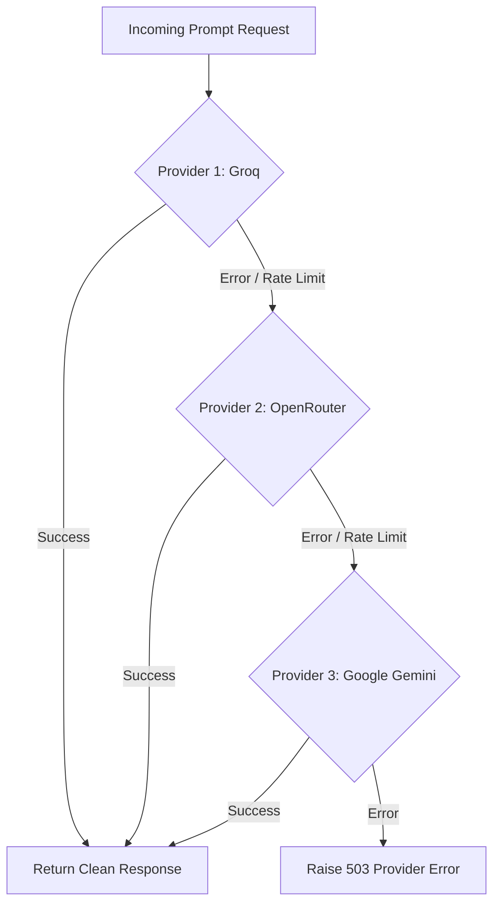

# 🤖 Microservice 4: Python ML Service (Port 8000)

The **Python ML Service** is a high-performance microservice built with **FastAPI** and **Python 3.11**. It handles compute-heavy natural language processing tasks: parsing binary PDF resumes into structured JSON models, rewriting experience bullets using the STAR methodology, and calculating portfolio ATS scores.

---

## 🎯 Core Responsibilities

```
                                  ┌─────────────────────────────┐
                                  │   Portfolio Backend (:5000) │
                                  └──────────────┬──────────────┘
                                                 │ HTTP POST
                                                 ▼
                                  ┌─────────────────────────────┐
                                  │    FastAPI Application      │
                                  └──────────────┬──────────────┘
                                                 │
            ┌────────────────────────────┼────────────────────────────┐
            ▼                            ▼                            ▼
┌────────────────────────┐  ┌────────────────────────┐  ┌────────────────────────┐
│  PDF Resume Extraction │  │  Bio & Bullet Enhancer │  │  ATS Portfolio Scoring │
│• PyMuPDF (fitz) parser │  │• STAR methodology      │  │• Readability analysis  │
│• Multi-column layout   │  │• Action verbs & metrics│  │• Keyword density check │
│• Strict Pydantic JSON  │  │• Grammar & style fix   │  │• Section completeness  │
└───────────┬────────────┘  └───────────┬────────────┘  └───────────┬────────────┘
            │                           │                           │
            └───────────────────────────┴─────────────┬─────────────┘
                                                      │
                                                      ▼
                                       ┌─────────────────────────────┐
                                       │ Multi-Provider LLM Fallback │
                                       │ 1. Groq (Llama 3.3 70B)     │
                                       │ 2. OpenRouter (Llama 3.2)   │
                                       │ 3. Google Gemini 1.5 Flash  │
                                       └─────────────────────────────┘
```

1. **Multi-Column PDF Parsing:** Extracts clean text from uploaded PDF resumes using `PyMuPDF` (`fitz`), overcoming formatting issues common in two-column templates.
2. **Schema-Enforced Structured Extraction:** Converts raw resume text into structured Pydantic models containing Personal Information, Work Experience, Education, Projects, and Skills.
3. **STAR-Method Content Enhancement:** Transforms basic bullet points (e.g., *"worked on backend"*) into high-impact, metric-driven achievements (e.g., *"Architected high-throughput NestJS microservices reducing API latency by 35%"*).
4. **Resilient Multi-Provider LLM Engine:** Automatically falls back across multiple AI providers to ensure 99.9% availability without paid API lock-in.

---

## 🧠 Multi-Provider LLM Fallback Engine

The service implements an automatic failover cascade in `app/services/llm_service.py`:



1. **Provider 1: Groq (`llama-3.3-70b-versatile` / `llama-3.1-8b-instant`)**
   - Blazing-fast inference speeds (~500 tokens/sec).
   - Generous free tier quotas ideal for real-time user-facing resume parsing.
2. **Provider 2: OpenRouter (`meta-llama/llama-3.2-3b-instruct:free`, `mistralai/mistral-7b-instruct:free`)**
   - Free fallback router activated when primary provider hits rate limits.
3. **Provider 3: Google Gemini (`gemini-1.5-flash` / `gemini-1.5-pro`)**
   - State-of-the-art context window and reasoning capabilities for large and complex resumes.

---

## 📋 Resume Extraction Pipeline

When a user uploads a PDF:
1. **Binary Stream Handling:** Uploaded via `multipart/form-data` to `/api/ml/parse-resume`.
2. **Text Normalization:** `PyMuPDF` extracts blocks of text in visual reading order, avoiding interleaving columns.
3. **Prompt Injection:** Injected into system prompt instructing the model to output strict JSON conforming to the target schema.
4. **Pydantic Validation:** The JSON response is parsed into the `ParsedResumeResponse` Pydantic model:
   ```python
   class ParsedResumeResponse(BaseModel):
       personal_info: PersonalInfoSchema
       skills: List[SkillCategorySchema]
       experiences: List[ExperienceSchema]
       projects: List[ProjectSchema]
       education: List[EducationSchema]
       certifications: List[CertificationSchema]
   ```
5. **Sanitization:** Escapes special characters, validates dates, and returns formatted JSON to the Portfolio Backend.

---

## 📡 API Endpoints Specification

### 1. Service Health & Provider Status
- **Method / Route:** `GET /health`
- **Response (`200 OK`):**
  ```json
  {
    "status": "healthy",
    "providers": {
      "groq": true,
      "openrouter": true,
      "gemini": true
    }
  }
  ```

### 2. Parse Resume PDF
- **Method / Route:** `POST /api/ml/parse-resume`
- **Request:** `multipart/form-data` with `file: resume.pdf`
- **Response (`200 OK`):** Structured JSON with parsed resume sections.

### 3. Enhance Text / Bullet Points
- **Method / Route:** `POST /api/ml/enhance`
- **Request Body:**
  ```json
  {
    "text": "Developed an API gateway using NestJS and handled authentication with JWT tokens.",
    "context": "Backend Experience Bullet",
    "tone": "professional"
  }
  ```
- **Response (`200 OK`):**
  ```json
  {
    "enhanced_text": "Architected a resilient NestJS API Gateway facade implementing centralized JWT validation, reducing inter-service latency and securing 15+ microservice endpoints."
  }
  ```

### 4. Portfolio Completeness & ATS Scoring
- **Method / Route:** `POST /api/ml/score`
- **Request Body:** Complete portfolio JSON payload
- **Response (`200 OK`):** ATS score (0-100), readability rating, missing sections, and keyword suggestions.

---

## 🔐 Environment Variables Specification

| Variable | Type | Required | Default | Description |
|---|---|---|---|---|
| `PORT` | Number | No | `8000` (or `10000` in prod) | Uvicorn server port |
| `GROQ_API_KEY` | String | No | — | API key for Groq Cloud inference |
| `OPENROUTER_API_KEY`| String | No | — | API key for OpenRouter inference |
| `GEMINI_API_KEY` | String | No | — | Google AI Studio Gemini API Key |

> [!TIP]
> At least one LLM API key must be provided for AI features to operate. Supplying all three ensures seamless fallback protection.

---

## 🛠️ Verification & Testing Commands

```bash
# Navigate to ML service directory
cd ml-service-python

# Activate virtual environment (if applicable)
# .venv\Scripts\activate

# Run Pytest suite
pytest tests/

# Run Flake8 syntax and linting checks
flake8 app --count --select=E9,F63,F7,F82 --show-source --statistics

# Start local FastAPI server with live reload
uvicorn app.main:app --port 8000 --reload
```

---

[Explore Frontend Architecture & 11 Templates ➔](Frontend-Architecture-and-Templates)
